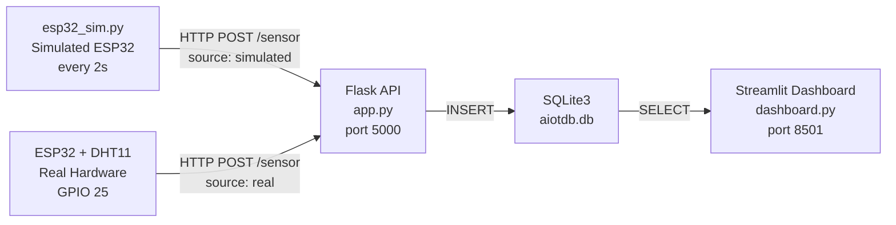

# AIoT HW1 — ESP32 IoT Sensor Dashboard

An AIoT system that collects temperature and humidity data from a real ESP32 + DHT11 sensor and a Python-based simulator, stores it in SQLite, and visualizes it on a live Streamlit dashboard.

## Architecture



## Files

| File | Description |
|---|---|
| `app.py` | Flask REST API — receives sensor data, stores to SQLite |
| `esp32_sim.py` | ESP32 simulator — sends fake DHT11 data every 2s |
| `dashboard.py` | Streamlit dashboard — KPIs, alerts, real-time charts |
| `esp32_dht11.ino` | Arduino sketch for real ESP32 + DHT11 hardware |
| `dev_log.md` | Full development log |

## API Endpoints

| Method | Route | Description |
|---|---|---|
| POST | `/sensor` | Receive sensor data |
| GET | `/sensors` | Last 100 readings (JSON) |
| GET | `/sensors/count` | Total row count |
| GET | `/health` | Liveness check |

## Setup

```bash
git clone https://github.com/SunnyTee2005/AIoT-HW1-ESP32-IoT-System.git
cd AIoT-HW1-ESP32-IoT-System
python -m venv venv
source venv/bin/activate
pip install -r requirements.txt
```

## Run

```bash
# Terminal 1 — Flask
python app.py

# Terminal 2 — Simulator
python esp32_sim.py

# Terminal 3 — Dashboard
streamlit run dashboard.py
```

Open `http://localhost:8501` in your browser.

## Hardware (Real ESP32)

- **Board:** ESP32 DevKit
- **Sensor:** DHT11 — DATA → GPIO 25, VCC → 3.3V, GND → GND
- **Library:** SimpleDHT
- Fill in your WiFi credentials and Flask server IP in `esp32_dht11.ino` before uploading
