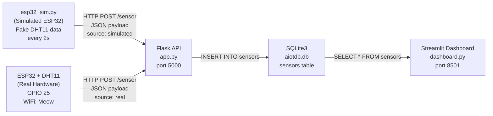

# AIoT HW1 — Development Log

**Project:** AIoT Sensor Dashboard
**Date:** 2026-03-31
**Stack:** ESP32 + DHT11 → Flask (HTTP POST) → SQLite3 → Streamlit

---

## Architecture Overview



---

## File Structure

| File | Purpose |
|---|---|
| `app.py` | Flask REST API — receives sensor POSTs, stores to SQLite |
| `esp32_sim.py` | ESP32 simulator — sends fake DHT11 readings every 2s |
| `dashboard.py` | Streamlit dashboard — KPIs, alerts, charts, raw data table |
| `esp32_dht11.ino` | Arduino sketch for real ESP32 + DHT11 hardware |
| `requirements.txt` | Python dependencies |

---

## Database Schema

```sql
CREATE TABLE IF NOT EXISTS sensors (
    id          INTEGER PRIMARY KEY AUTOINCREMENT,
    device_id   TEXT,
    ssid        TEXT,
    ip_address  TEXT,
    temperature REAL,
    humidity    REAL,
    source      TEXT,      -- "real" or "simulated"
    timestamp   DATETIME DEFAULT CURRENT_TIMESTAMP
);
```

---

## API Endpoints

| Method | Route | Description | Response |
|---|---|---|---|
| POST | `/sensor` | Receive sensor data, store to DB | 201 Created |
| GET | `/sensors` | Return last 100 readings as JSON | 200 OK |
| GET | `/sensors/count` | Return total row count | 200 OK |
| GET | `/health` | Liveness check | 200 OK |

### POST /sensor — Payload

```json
{
  "device_id":   "ESP32-REAL-001",
  "ssid":        "Meow",
  "ip_address":  "192.168.1.xxx",
  "temperature": 27.3,
  "humidity":    62.1,
  "source":      "real"
}
```

---

## Step 1 — Flask Backend (app.py)

Built a Flask REST API with four endpoints. SQLite database is auto-created on startup via `init_db()`. The `source` field distinguishes real hardware data from simulated data within the same table.

**Key design decisions:**
- Used `?` placeholders in SQL queries to prevent SQL injection
- `host='0.0.0.0'` allows ESP32 on the same LAN to connect
- `IF NOT EXISTS` in CREATE TABLE prevents errors on restart

---

## Step 2 — ESP32 Simulator (esp32_sim.py)

Simulates a WiFi-connected ESP32 sending DHT11 readings every 2 seconds. Uses Python's `random.uniform()` to generate realistic temperature (20–35°C) and humidity (40–80%) values.

**Flask output confirmed:**
```
127.0.0.1 - [31/Mar/2026] "POST /sensor HTTP/1.1" 201 -
127.0.0.1 - [31/Mar/2026] "POST /sensor HTTP/1.1" 201 -
```

---

## Step 3 — SQLite3 DB Verified

```bash
# Verified via browser
http://localhost:5000/sensors
http://localhost:5000/sensors/count
```

Sample rows returned with all fields correctly stored: `device_id`, `ssid`, `ip_address`, `temperature`, `humidity`, `source`, `timestamp`.

---

## Step 4 — Real ESP32 Hardware

**Hardware:** ESP32 DevKit + DHT11 sensor
**Library:** SimpleDHT
**Connection:** DHT11 DATA → GPIO 25, VCC → 3.3V, GND → GND
**WiFi:** Connected to local network, HTTP POST to Flask at `192.168.1.195:5000`

Serial Monitor output:
```
Connecting to WiFi: Meow
....
WiFi connected!
ESP32 IP: 192.168.1.xxx
Temp: 27C  Humid: 63%
Server response: 201 Created OK
```

---

## Step 5 — Streamlit Dashboard (dashboard.py)

Dashboard components:
- **4 KPI cards**: Latest Temperature, Latest Humidity, Total Readings, Last Update (seconds ago)
- **Alert banners**: Temperature > 33°C or Humidity out of 45–75% range
- **Sidebar**: Filter by source (All / real / simulated), reading counts per source
- **Temperature & Humidity charts**: Side by side, real and simulated plotted as separate colored lines
- **Raw data table**: Last 100 readings

Auto-refreshes every 2 seconds via `st.rerun()`.

**Note on LAN access:** Streamlit must be started with `--server.address 192.168.1.195` when NordVPN is active, as VPN creates a virtual interface that takes routing priority over the WiFi interface.

---

## Step 6 — Health Check Verified

```bash
curl http://localhost:5000/health
# {"db": "aiotdb.db", "status": "ok"}
```

---

## Final Summary

| Component | Status | URL |
|---|---|---|
| Flask API | ✅ Running | `http://localhost:5000` |
| `/health` endpoint | ✅ Verified | `http://localhost:5000/health` |
| SQLite3 DB | ✅ Populating | `aiotdb.db` |
| ESP32 Simulator | ✅ Running | posts every 2s |
| Real ESP32 + DHT11 | ✅ Running | posts every 2s |
| Streamlit Dashboard | ✅ Running | `http://localhost:8501` |

---

## Re-run Commands

```bash
# Terminal 1 — Flask
cd "/Users/sunnytee/Desktop/AIoT Projects/AIoT_HW1"
source venv/bin/activate
python app.py

# Terminal 2 — ESP32 Simulator
cd "/Users/sunnytee/Desktop/AIoT Projects/AIoT_HW1"
source venv/bin/activate
python esp32_sim.py

# Terminal 3 — Streamlit Dashboard
cd "/Users/sunnytee/Desktop/AIoT Projects/AIoT_HW1"
source venv/bin/activate
streamlit run dashboard.py --server.address 192.168.1.195
```
